# System Architecture & Workflow Diagrams (Mermaid)

## 1. System Architecture Diagram

```mermaid
graph TB
    subgraph Client["🖥️ Client Layer"]
        Browser["Web Browser<br/>(Swagger UI)"]
        Dashboard["📊 Dashboard<br/>(Streamlit)"]
    end

    subgraph API["🔌 API Layer<br/>(FastAPI)"]
        Routes["Routes & Schemas<br/>(Pydantic Validation)"]
        Health["Health Check"]
    end

    subgraph Agent["🧠 Agent Orchestration<br/>(LangGraph)"]
        Graph["StateGraph<br/>Graph Compilation"]
        Fetch["fetch_account_node<br/>(DB/CRM Lookup)"]
        Analyze["analyze_issue_node<br/>(LLM Analysis)"]
        Execute["execute_actions_node<br/>(SF + Billing APIs)"]
        Summarize["summarize_node<br/>(Response Compilation)"]
    end

    subgraph Services["⚙️ Services Layer"]
        SF["Salesforce Service<br/>(REST API + OAuth)"]
        Billing["Billing Service<br/>(Task Management)"]
        Config["Configuration<br/>(Environment Variables)"]
    end

    subgraph External["🌐 External Systems"]
        OpenAI["🤖 OpenAI API<br/>(GPT-4o-mini)"]
        SFAPI["🔷 Salesforce API<br/>(Case Creation)"]
        BillingAPI["💳 Billing API<br/>(Task Processing)"]
    end

    subgraph Observability["📈 Observability"]
        Traces["Agent Traces<br/>(Execution History)"]
        Metrics["Metrics<br/>(Success Rate, Confidence)"]
        Logging["Logging<br/>(Structured Logs)"]
    end

    Browser -->|POST /resolve-issue| Routes
    Dashboard -->|GET /traces, /metrics| Routes
    Routes -->|Initialize State| Graph
    Graph -->|Invoke| Fetch
    Fetch -->|State Update| Analyze
    Analyze -->|Route (confidence-based)| Execute
    Analyze -->|Route| Summarize
    Execute -->|Execute Actions| SF
    Execute -->|Execute Actions| Billing
    Execute -->|State Update| Summarize
    Summarize -->|Final Summary| Routes
    SF -->|OAuth + POST| SFAPI
    Billing -->|HTTP POST| BillingAPI
    Analyze -->|LLM Prompt| OpenAI
    OpenAI -->|JSON Response| Analyze
    Routes -->|Record| Traces
    Routes -->|Update| Metrics
    Analyze -->|Log| Logging
    Execute -->|Log| Logging
    Routes -->|Send Response| Browser
    Traces -->|Display| Dashboard
    Metrics -->|Display| Dashboard
    Config -.->|Env Vars| SF
    Config -.->|Env Vars| Billing
    Config -.->|Env Vars| Analyze
```

## 2. LangGraph Agent Workflow

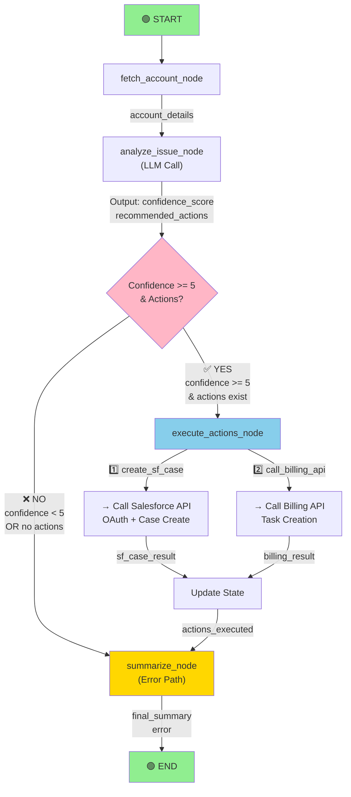

## 3. Confidence Scoring & Gating

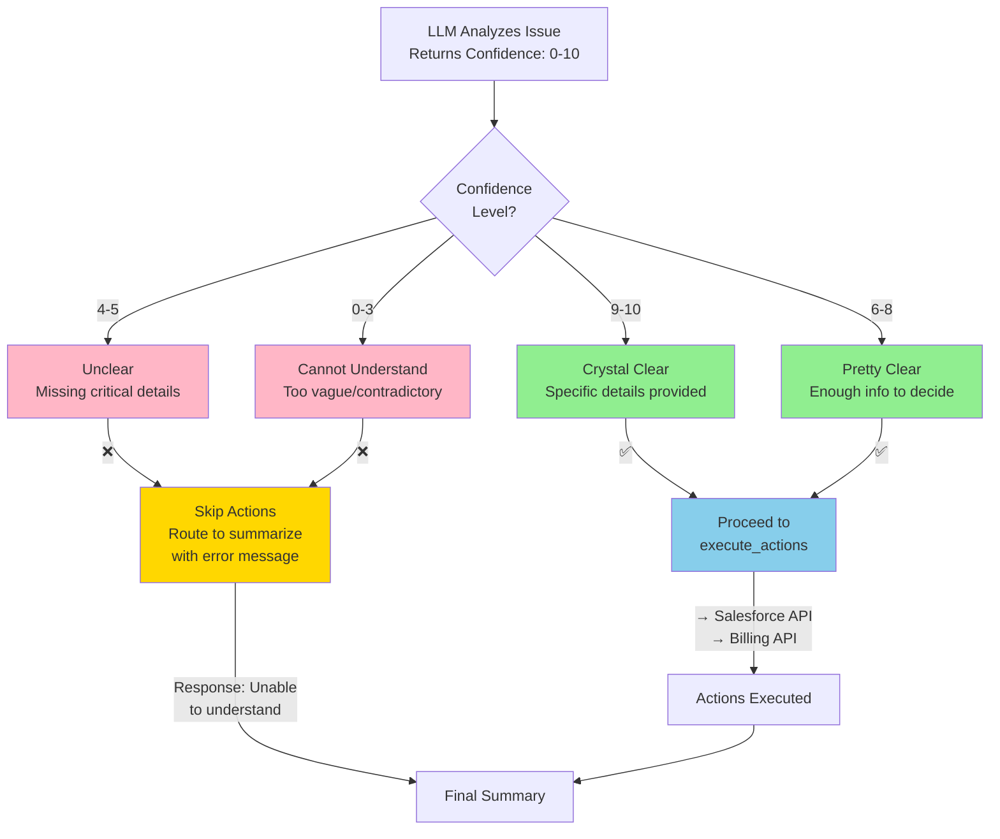

## 4. Conditional Router Logic

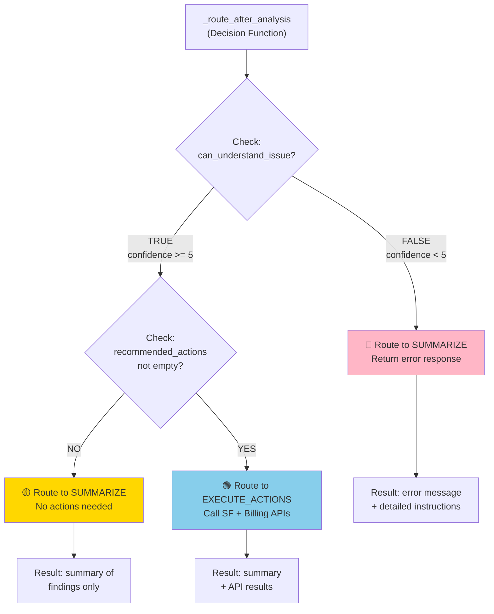

## 5. Data Flow Through AgentState

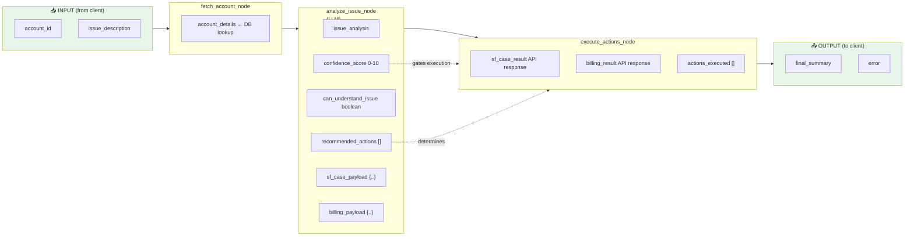

## 6. State Machine Transitions

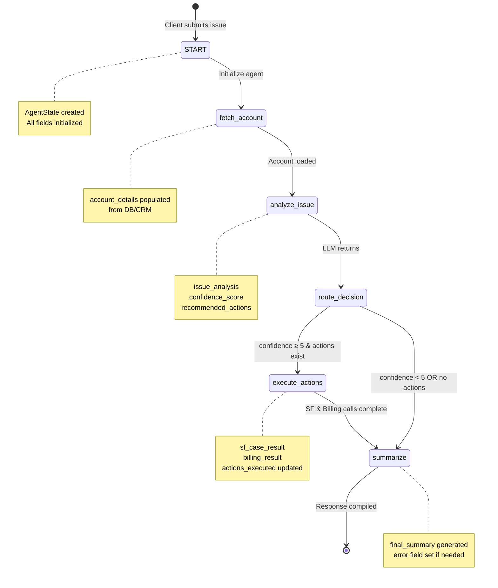

## 7. API Endpoints & Data Models

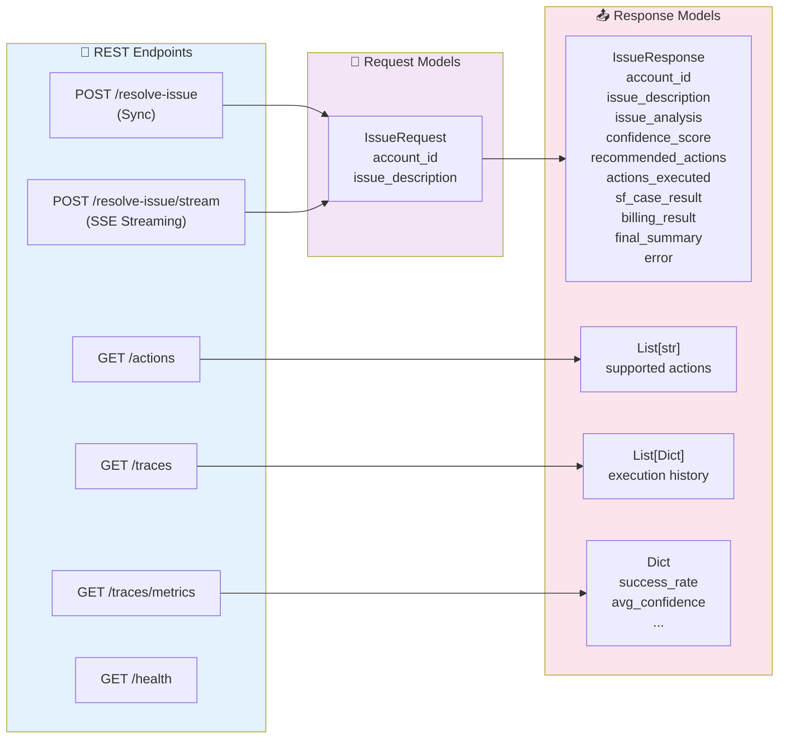

## 8. External API Integration

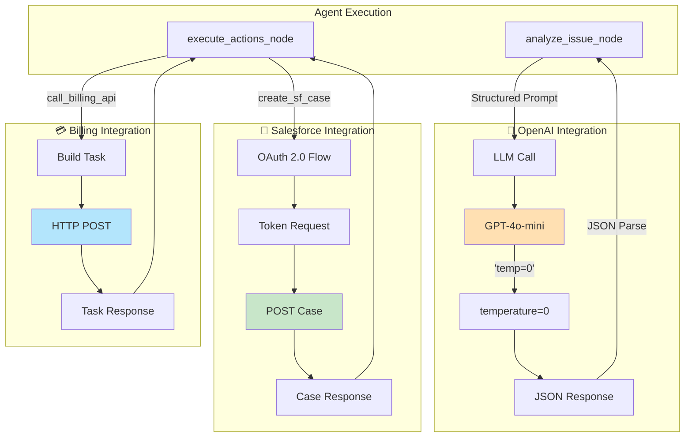

## 9. Error Handling Flow

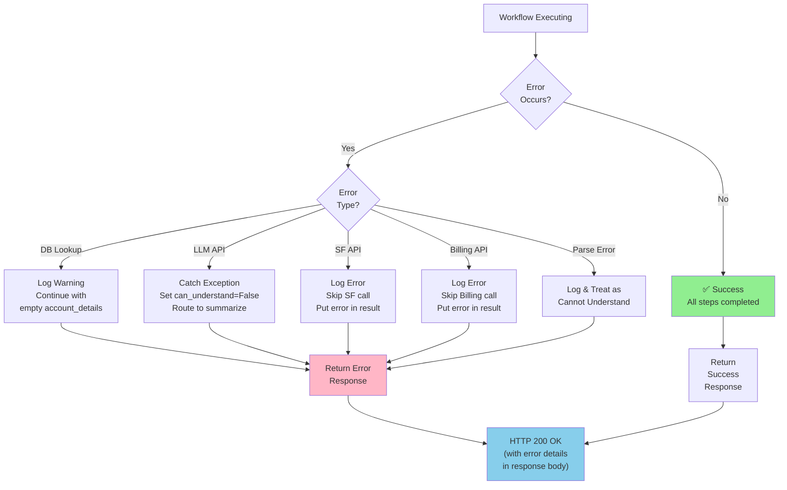

## 10. Execution Timeline

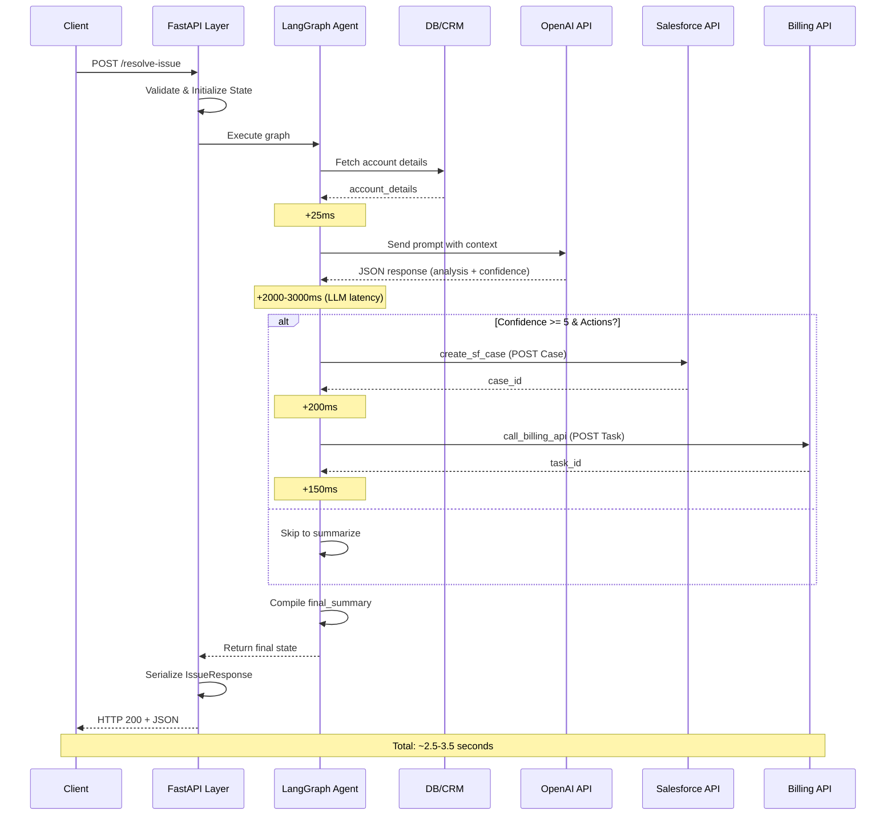

## 11. Database Schema (Future)

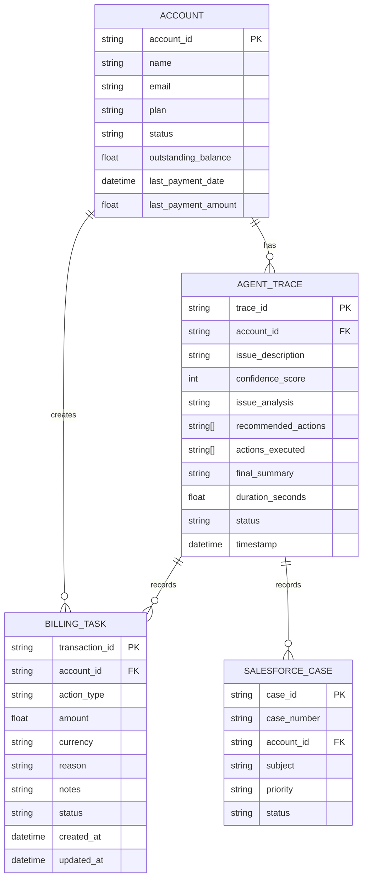

## 12. Component Dependency Graph

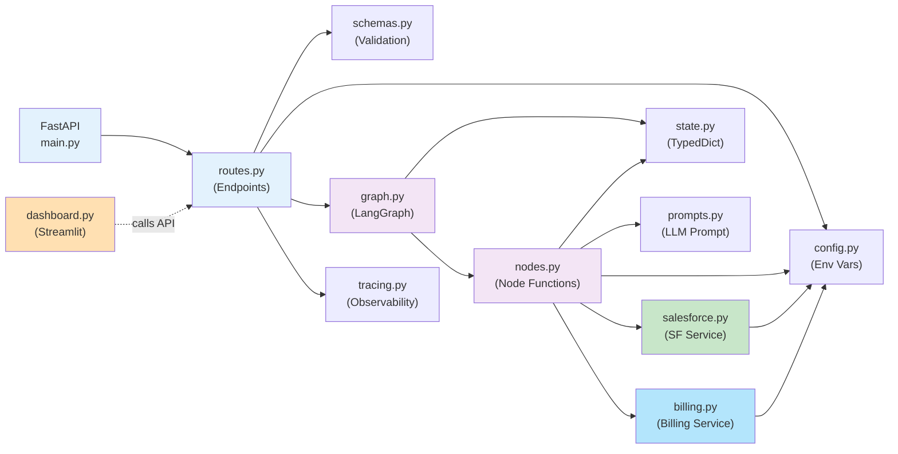

## 13. Mock vs Real Flow

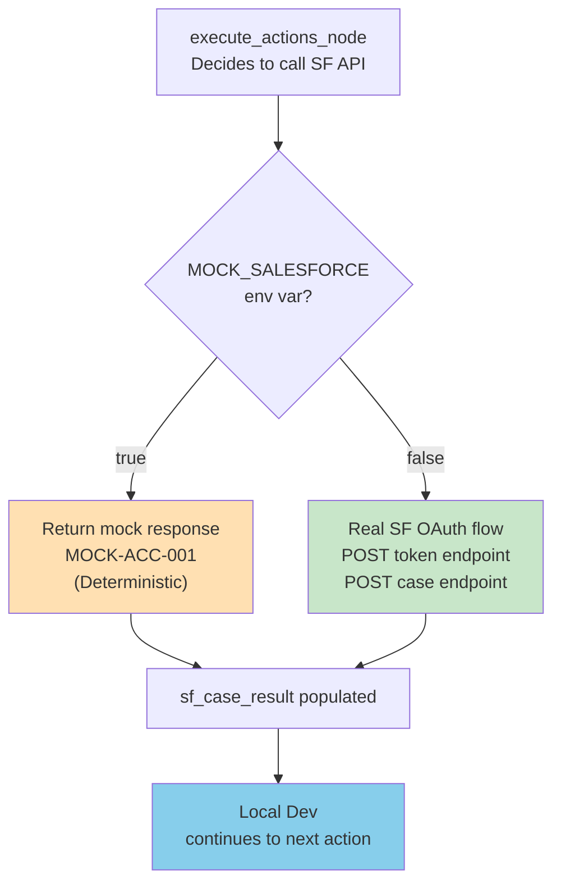

---

This visual representation covers:
1. ✅ System architecture with all components
2. ✅ LangGraph workflow & conditional routing
3. ✅ Confidence gating mechanism
4. ✅ State machine transitions
5. ✅ API endpoints & data models
6. ✅ External API integrations
7. ✅ Error handling paths
8. ✅ Execution sequence & timing
9. ✅ Future database schema
10. ✅ Component dependencies
11. ✅ Mock vs real execution paths
