# TicketWorkflow - Architecture Diagrams

## 1. System Architecture Overview

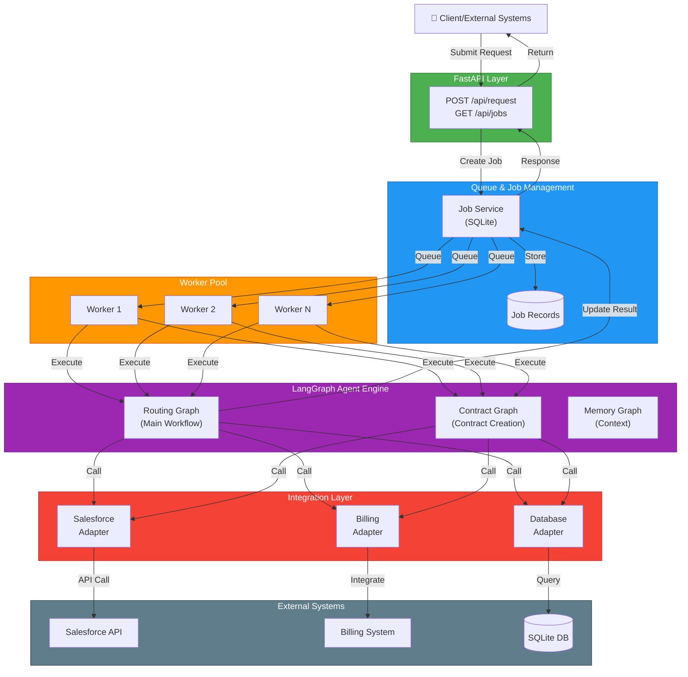

---

## 2. Complete Request Processing Flow

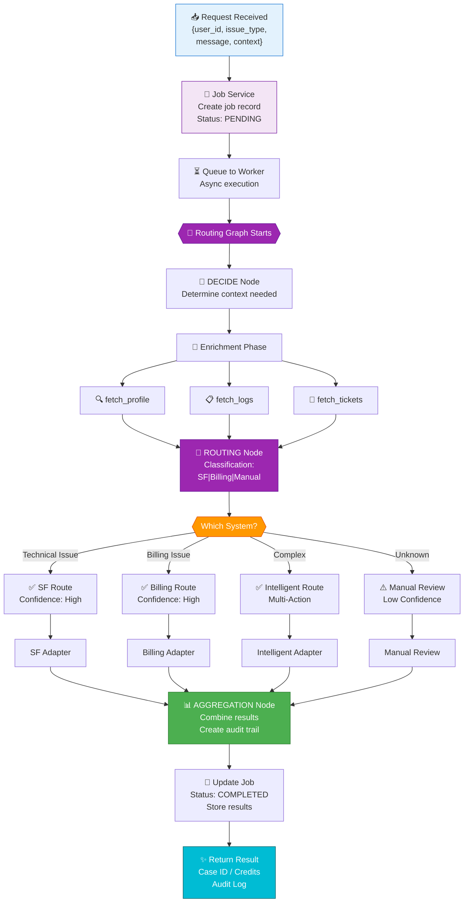

---

## 3. LangGraph - Routing Workflow State Machine

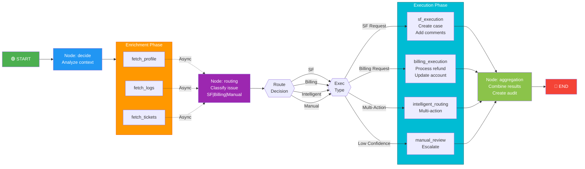

---

## 4. Three Core Workflow Types

```mermaid
graph TB
    subgraph W1["Workflow 1: Simple SF Integration"]
        W1A["Input:<br/>user_id, tech_issue"]
        W1B["Classify:<br/>Technical → SF"]
        W1C["Create Case"]
        W1D["Return: case_id"]
        W1A --> W1B --> W1C --> W1D
    end
    
    subgraph W2["Workflow 2: Intelligent SF"]
        W2A["Input:<br/>Complex issue<br/>+ context"]
        W2B["Classify +<br/>Run AI Agent"]
        W2C["Parse Suggestions"]
        W2D["Map to Actions:<br/>Primary<br/>Secondary<br/>Tertiary"]
        W2E["Execute<br/>Multi-action"]
        W2F["Return:<br/>Results + Audit"]
        W2A --> W2B --> W2C --> W2D --> W2E --> W2F
    end
    
    subgraph W3["Workflow 3: Contract Generation"]
        W3A["Input:<br/>Tenant info<br/>Dates"]
        W3B["Validate:<br/>Dates<br/>Required fields"]
        W3C["Prepare:<br/>Format data<br/>Template fill"]
        W3D["Create:<br/>Generate ID<br/>Store DB"]
        W3E["Return:<br/>contract_id<br/>PDF"]
        W3A --> W3B --> W3C --> W3D --> W3E
    end
    
    style W1 fill:#B3E5FC,stroke:#01579B,color:#000
    style W2 fill:#E1BEE7,stroke:#4A148C,color:#000
    style W3 fill:#C8E6C9,stroke:#1B5E20,color:#000
```

---

## 5. Data Flow - Intelligent Action Service

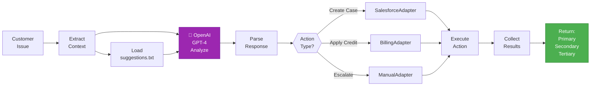

---

## 6. Why LangGraph vs LangChain

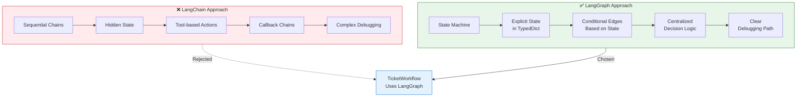

---

## 7. Service Adapter Pattern

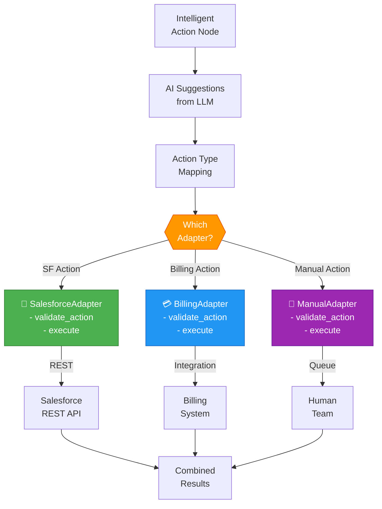

---

## 8. State Management Structure

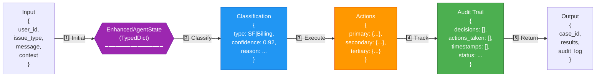

---

## 9. Contract Generation Workflow (LangGraph)

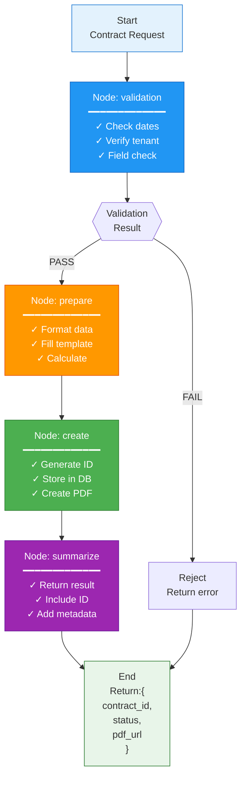

---

## 10. Multi-Action Orchestration Flow

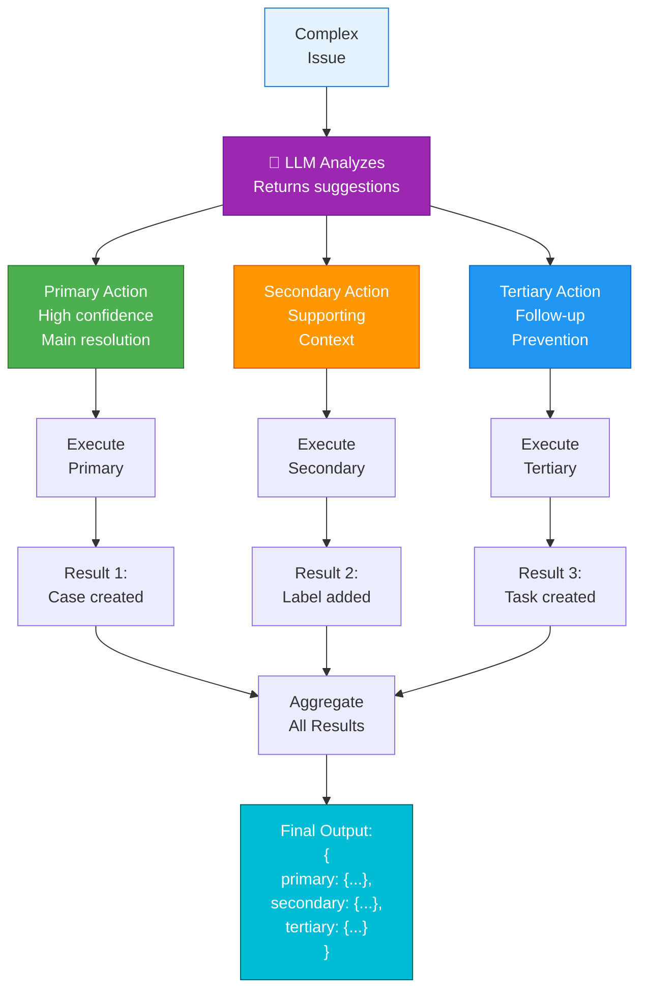

---

## 11. Component Interaction Matrix

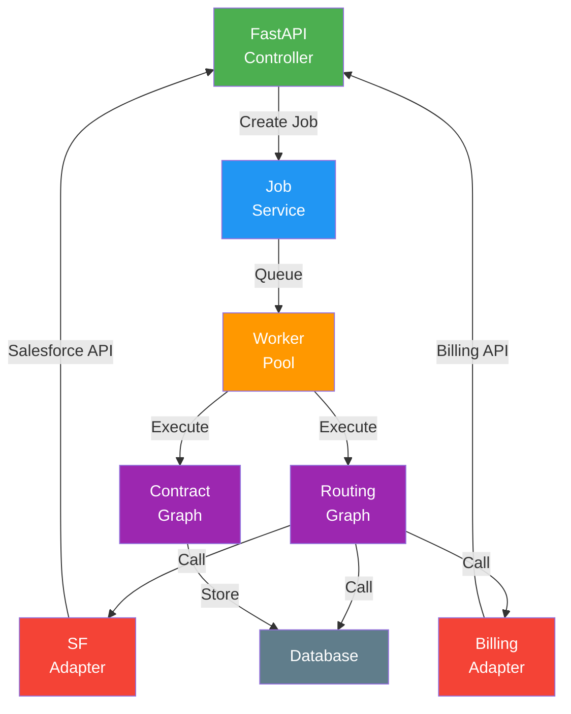

---

## 12. End-to-End Execution Timeline

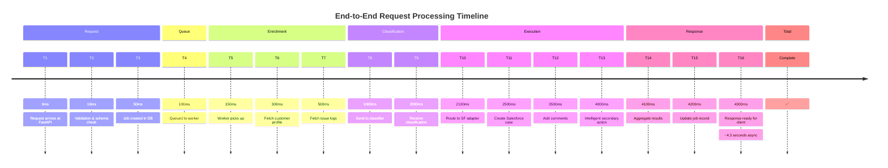

