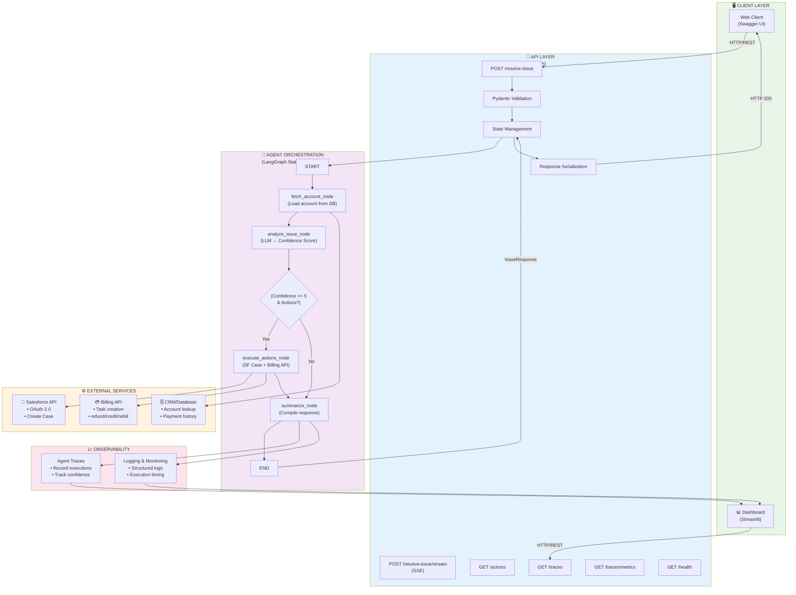

# Draw.io Compatible Architecture Diagram

## Instructions
1. Open [draw.io](https://www.draw.io)
2. Create a new diagram
3. Copy one of the formats below and paste it into draw.io
4. For Mermaid: Use File → Import from → Mermaid

---

## Option 1: Mermaid Diagram (Recommended - Easiest to Import)



---

## Option 2: Draw.io XML (Direct Import)

Save this as `.drawio` file and open in draw.io:

```xml
<mxfile host="draw.io" modified="2026-05-11" agent="5.0" version="20.7.4" type="device">
  <diagram name="Architecture" id="diagram1">
    <mxGraphModel dx="1200" dy="800" grid="1" gridSize="10" guides="1" tooltips="1" connect="1" arrows="1" fold="1" page="1" pageScale="1" pageWidth="1600" pageHeight="900" math="0" shadow="0">
      <root>
        <mxCell id="0"/>
        <mxCell id="1" parent="0"/>
        
        <!-- CLIENT LAYER -->
        <mxCell id="c1" value="CLIENT LAYER" style="rounded=1;whiteSpace=wrap;html=1;fillColor=#E8F5E9;strokeWidth=2;" vertex="1" parent="1">
          <mxGeometry x="50" y="20" width="500" height="80" as="geometry"/>
        </mxCell>
        <mxCell id="c2" value="Web Client&#xa;(Swagger UI)" style="rounded=1;whiteSpace=wrap;html=1;fillColor=#C8E6C9;" vertex="1" parent="1">
          <mxGeometry x="70" y="35" width="120" height="50" as="geometry"/>
        </mxCell>
        <mxCell id="c3" value="Dashboard&#xa;(Streamlit)" style="rounded=1;whiteSpace=wrap;html=1;fillColor=#C8E6C9;" vertex="1" parent="1">
          <mxGeometry x="420" y="35" width="120" height="50" as="geometry"/>
        </mxCell>
        
        <!-- API LAYER -->
        <mxCell id="a1" value="API LAYER (FastAPI)" style="rounded=1;whiteSpace=wrap;html=1;fillColor=#E3F2FD;strokeWidth=2;" vertex="1" parent="1">
          <mxGeometry x="50" y="140" width="500" height="120" as="geometry"/>
        </mxCell>
        <mxCell id="a2" value="POST /resolve-issue&#xa;POST /resolve-issue/stream (SSE)&#xa;GET /actions / /traces / /metrics&#xa;GET /health" style="rounded=1;whiteSpace=wrap;html=1;fillColor=#BBDEFB;" vertex="1" parent="1">
          <mxGeometry x="70" y="155" width="460" height="55" as="geometry"/>
        </mxCell>
        <mxCell id="a3" value="Validation (Pydantic) | State Mgmt | Serialization" style="rounded=1;whiteSpace=wrap;html=1;fillColor=#BBDEFB;fontSize=11;" vertex="1" parent="1">
          <mxGeometry x="70" y="215" width="460" height="35" as="geometry"/>
        </mxCell>
        
        <!-- AGENT LAYER -->
        <mxCell id="ag1" value="AGENT ORCHESTRATION (LangGraph)" style="rounded=1;whiteSpace=wrap;html=1;fillColor=#F3E5F5;strokeWidth=2;" vertex="1" parent="1">
          <mxGeometry x="50" y="300" width="500" height="340" as="geometry"/>
        </mxCell>
        <mxCell id="ag2" value="START" style="rounded=1;whiteSpace=wrap;html=1;fillColor=#E1BEE7;" vertex="1" parent="1">
          <mxGeometry x="215" y="320" width="170" height="30" as="geometry"/>
        </mxCell>
        <mxCell id="ag3" value="fetch_account_node" style="rounded=1;whiteSpace=wrap;html=1;fillColor=#E1BEE7;" vertex="1" parent="1">
          <mxGeometry x="180" y="380" width="240" height="35" as="geometry"/>
        </mxCell>
        <mxCell id="ag4" value="analyze_issue_node&#xa;(LLM → Confidence)" style="rounded=1;whiteSpace=wrap;html=1;fillColor=#E1BEE7;" vertex="1" parent="1">
          <mxGeometry x="180" y="440" width="240" height="40" as="geometry"/>
        </mxCell>
        <mxCell id="ag5" value="Confidence >= 5&#xa;&amp; Actions?" style="rhombus;whiteSpace=wrap;html=1;fillColor=#FFCCBC;" vertex="1" parent="1">
          <mxGeometry x="210" y="510" width="180" height="60" as="geometry"/>
        </mxCell>
        <mxCell id="ag6" value="execute_actions_node" style="rounded=1;whiteSpace=wrap;html=1;fillColor=#E1BEE7;" vertex="1" parent="1">
          <mxGeometry x="100" y="600" width="150" height="35" as="geometry"/>
        </mxCell>
        <mxCell id="ag7" value="summarize_node" style="rounded=1;whiteSpace=wrap;html=1;fillColor=#E1BEE7;" vertex="1" parent="1">
          <mxGeometry x="310" y="600" width="150" height="35" as="geometry"/>
        </mxCell>
        <mxCell id="ag8" value="END" style="rounded=1;whiteSpace=wrap;html=1;fillColor=#E1BEE7;" vertex="1" parent="1">
          <mxGeometry x="215" y="660" width="170" height="30" as="geometry"/>
        </mxCell>
        
        <!-- EXTERNAL SERVICES -->
        <mxCell id="e1" value="EXTERNAL SERVICES" style="rounded=1;whiteSpace=wrap;html=1;fillColor=#FFF3E0;strokeWidth=2;" vertex="1" parent="1">
          <mxGeometry x="610" y="300" width="190" height="340" as="geometry"/>
        </mxCell>
        <mxCell id="e2" value="Salesforce API&#xa;• OAuth 2.0&#xa;• Create Case" style="rounded=1;whiteSpace=wrap;html=1;fillColor=#FFE0B2;" vertex="1" parent="1">
          <mxGeometry x="625" y="330" width="160" height="70" as="geometry"/>
        </mxCell>
        <mxCell id="e3" value="Billing API&#xa;• Task creation&#xa;• refund/credit/rebill" style="rounded=1;whiteSpace=wrap;html=1;fillColor=#FFE0B2;" vertex="1" parent="1">
          <mxGeometry x="625" y="430" width="160" height="70" as="geometry"/>
        </mxCell>
        <mxCell id="e4" value="CRM/Database&#xa;• Account lookup&#xa;• Payment history" style="rounded=1;whiteSpace=wrap;html=1;fillColor=#FFE0B2;" vertex="1" parent="1">
          <mxGeometry x="625" y="530" width="160" height="70" as="geometry"/>
        </mxCell>
        
        <!-- OBSERVABILITY -->
        <mxCell id="o1" value="OBSERVABILITY" style="rounded=1;whiteSpace=wrap;html=1;fillColor=#FCE4EC;strokeWidth=2;" vertex="1" parent="1">
          <mxGeometry x="850" y="300" width="200" height="340" as="geometry"/>
        </mxCell>
        <mxCell id="o2" value="Agent Traces&#xa;• Record executions&#xa;• Track confidence" style="rounded=1;whiteSpace=wrap;html=1;fillColor=#F8BBD0;" vertex="1" parent="1">
          <mxGeometry x="865" y="330" width="170" height="70" as="geometry"/>
        </mxCell>
        <mxCell id="o3" value="Logging &amp; Monitoring&#xa;• Structured logs&#xa;• Execution timing" style="rounded=1;whiteSpace=wrap;html=1;fillColor=#F8BBD0;" vertex="1" parent="1">
          <mxGeometry x="865" y="430" width="170" height="70" as="geometry"/>
        </mxCell>
        
        <!-- CONNECTIONS -->
        <mxCell id="conn1" value="" style="edgeStyle=orthogonalEdgeStyle;rounded=0;orthogonalLoop=1;jettySize=auto;html=1;" edge="1" parent="1" source="c2" target="a2">
          <mxGeometry relative="1" as="geometry"/>
        </mxCell>
        <mxCell id="conn2" value="" style="edgeStyle=orthogonalEdgeStyle;rounded=0;orthogonalLoop=1;jettySize=auto;html=1;" edge="1" parent="1" source="c3" target="a2">
          <mxGeometry relative="1" as="geometry"/>
        </mxCell>
        <mxCell id="conn3" value="" style="edgeStyle=orthogonalEdgeStyle;rounded=0;orthogonalLoop=1;jettySize=auto;html=1;" edge="1" parent="1" source="a3" target="ag2">
          <mxGeometry relative="1" as="geometry"/>
        </mxCell>
        <mxCell id="conn4" value="" style="edgeStyle=orthogonalEdgeStyle;rounded=0;orthogonalLoop=1;jettySize=auto;html=1;" edge="1" parent="1" source="ag2" target="ag3">
          <mxGeometry relative="1" as="geometry"/>
        </mxCell>
        <mxCell id="conn5" value="" style="edgeStyle=orthogonalEdgeStyle;rounded=0;orthogonalLoop=1;jettySize=auto;html=1;" edge="1" parent="1" source="ag3" target="ag4">
          <mxGeometry relative="1" as="geometry"/>
        </mxCell>
        <mxCell id="conn6" value="" style="edgeStyle=orthogonalEdgeStyle;rounded=0;orthogonalLoop=1;jettySize=auto;html=1;" edge="1" parent="1" source="ag4" target="ag5">
          <mxGeometry relative="1" as="geometry"/>
        </mxCell>
        <mxCell id="conn7" value="YES" style="edgeStyle=orthogonalEdgeStyle;rounded=0;orthogonalLoop=1;jettySize=auto;html=1;" edge="1" parent="1" source="ag5" target="ag6">
          <mxGeometry relative="1" as="geometry"/>
        </mxCell>
        <mxCell id="conn8" value="NO" style="edgeStyle=orthogonalEdgeStyle;rounded=0;orthogonalLoop=1;jettySize=auto;html=1;" edge="1" parent="1" source="ag5" target="ag7">
          <mxGeometry relative="1" as="geometry"/>
        </mxCell>
        <mxCell id="conn9" value="" style="edgeStyle=orthogonalEdgeStyle;rounded=0;orthogonalLoop=1;jettySize=auto;html=1;" edge="1" parent="1" source="ag6" target="ag7">
          <mxGeometry relative="1" as="geometry"/>
        </mxCell>
        <mxCell id="conn10" value="" style="edgeStyle=orthogonalEdgeStyle;rounded=0;orthogonalLoop=1;jettySize=auto;html=1;" edge="1" parent="1" source="ag7" target="ag8">
          <mxGeometry relative="1" as="geometry"/>
        </mxCell>
        <mxCell id="conn11" value="" style="edgeStyle=orthogonalEdgeStyle;rounded=0;orthogonalLoop=1;jettySize=auto;html=1;" edge="1" parent="1" source="ag6" target="e2">
          <mxGeometry relative="1" as="geometry"/>
        </mxCell>
        <mxCell id="conn12" value="" style="edgeStyle=orthogonalEdgeStyle;rounded=0;orthogonalLoop=1;jettySize=auto;html=1;" edge="1" parent="1" source="ag6" target="e3">
          <mxGeometry relative="1" as="geometry"/>
        </mxCell>
        <mxCell id="conn13" value="" style="edgeStyle=orthogonalEdgeStyle;rounded=0;orthogonalLoop=1;jettySize=auto;html=1;" edge="1" parent="1" source="ag3" target="e4">
          <mxGeometry relative="1" as="geometry"/>
        </mxCell>
        <mxCell id="conn14" value="" style="edgeStyle=orthogonalEdgeStyle;rounded=0;orthogonalLoop=1;jettySize=auto;html=1;" edge="1" parent="1" source="ag7" target="o2">
          <mxGeometry relative="1" as="geometry"/>
        </mxCell>
        <mxCell id="conn15" value="" style="edgeStyle=orthogonalEdgeStyle;rounded=0;orthogonalLoop=1;jettySize=auto;html=1;" edge="1" parent="1" source="ag7" target="o3">
          <mxGeometry relative="1" as="geometry"/>
        </mxCell>
        <mxCell id="conn16" value="" style="edgeStyle=orthogonalEdgeStyle;rounded=0;orthogonalLoop=1;jettySize=auto;html=1;" edge="1" parent="1" source="ag8" target="a3">
          <mxGeometry relative="1" as="geometry"/>
        </mxCell>
      </root>
    </mxGraphModel>
  </diagram>
</mxfile>
```

---

## Option 3: PlantUML Diagram

```plantuml
@startuml Architecture
!define CLIENTCOLOR #E8F5E9
!define APICOLOR #E3F2FD
!define AGENTCOLOR #F3E5F5
!define EXTCOLOR #FFF3E0
!define OBSCOLOR #FCE4EC

skinparam backgroundColor #FAFAFA
skinparam classBackgroundColor #FFFFFF
skinparam classBorderColor #333333

rectangle "🖥️ CLIENT LAYER" #CLIENTCOLOR [
  ["Web Client\n(Swagger UI)"]
  ["Dashboard\n(Streamlit)"]
]

rectangle "🔌 API LAYER (FastAPI)" #APICOLOR [
  ["POST /resolve-issue\nPOST /resolve-issue/stream (SSE)\nGET /actions, /traces, /metrics\nGET /health"]
  ["Validation | State Mgmt | Serialization"]
]

rectangle "🧠 AGENT ORCHESTRATION (LangGraph)" #AGENTCOLOR [
  START --> fetch_account_node
  fetch_account_node --> analyze_issue_node
  analyze_issue_node --> Router{Confidence >= 5\n& Actions?}
  Router -->|YES| execute_actions_node
  Router -->|NO| summarize_node
  execute_actions_node --> summarize_node
  summarize_node --> END
]

rectangle "⚙️ EXTERNAL SERVICES" #EXTCOLOR [
  ["Salesforce API\n• OAuth 2.0\n• Create Case"]
  ["Billing API\n• Task creation\n• refund/credit/rebill"]
  ["CRM/Database\n• Account lookup\n• Payment history"]
]

rectangle "📈 OBSERVABILITY" #OBSCOLOR [
  ["Agent Traces\n• Record executions\n• Track confidence"]
  ["Logging & Monitoring\n• Structured logs\n• Execution timing"]
]

@enduml
```

---

## Option 4: Quick Paste Template (Minimal Format)

If you want ultra-simple structure:

```
┌─ CLIENT LAYER ─────────────────────┐
│  Web Client (Swagger) | Dashboard  │
└──────────────────────────────────────┘
              ↓
┌─ API LAYER (FastAPI) ──────────────┐
│  POST /resolve-issue              │
│  POST /resolve-issue/stream        │
│  GET /actions, /traces, /metrics   │
│  Validation | State Mgmt | Response │
└──────────────────────────────────────┘
              ↓
┌─ AGENT (LangGraph) ────────────────┐
│  START → fetch_account             │
│       → analyze_issue              │
│       → [Confidence >= 5?]          │
│         ├─ YES → execute_actions   │
│         └─ NO → summarize          │
│       → END                        │
└──────────────────────────────────────┘
       ↙          ↓         ↘
    SF API    Billing API   Traces/Logs
```

---

## How to Use in Draw.io

### Method 1: Direct Paste (Easiest)
1. Open draw.io
2. Paste the **Mermaid code** into the editor
3. It auto-converts to visual diagram
4. Edit and rearrange as needed

### Method 2: Import File
1. Copy the **XML code** above
2. Create `architecture.drawio` file
3. Paste XML into it
4. Open in draw.io
5. Edit colors, positioning, etc.

### Method 3: Manual Recreation
1. Use the **Minimal Template** format above
2. Add shapes manually (faster for small diagrams)
3. Connect with arrows

---

## Tips for Draw.io

✅ **Color System:**
- Client: Light Green (#E8F5E9)
- API: Light Blue (#E3F2FD)
- Agent: Light Purple (#F3E5F5)
- External: Light Orange (#FFF3E0)
- Observability: Light Pink (#FCE4EC)

✅ **Shapes:**
- Boxes = Components
- Diamond = Decision point
- Arrows = Data flow

✅ **To Customize:**
- Double-click shapes to edit text
- Right-click to change colors
- Drag to rearrange
- Format panel on right

---

**Recommendation:** Use **Option 1 (Mermaid)** — it's the easiest to copy-paste directly into draw.io and looks professional!
